<div align="center">

# Stefan Vasilescu — Portfolio

**A bilingual, glass-and-motion personal website built to feel like a product, not a CV.**

[**stefanvasilescu.com**](https://stefanvasilescu.com) · Full-Stack Developer · CEO of Vesko Software · Co-Founder of Era Innovations

[](https://nextjs.org/)
[](https://www.typescriptlang.org/)
[](https://tailwindcss.com/)
[](https://www.framer.com/motion/)
[](https://github.com/stefanutz02/stefan-vasilescu-portfolio/releases/latest)
[](#license)
[](https://creativecommons.org/licenses/by-nc-sa/4.0/)

<br />

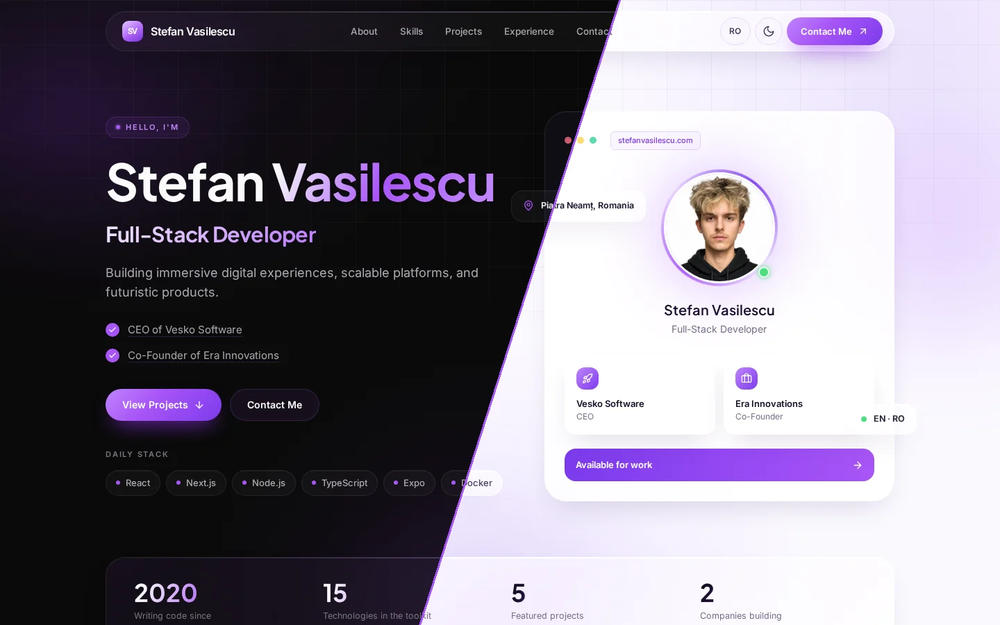

</div>

---

## Overview

This is the source code for my personal portfolio at **[stefanvasilescu.com](https://stefanvasilescu.com)**. It is a single-page, fully responsive site that shows who I am, what I build, and how to reach me.

Version 2 is a complete visual redesign. It uses the same design language as [vesko.ro](https://vesko.ro): frosted glass panels, soft aurora lighting, pill navigation and blur-in scroll reveals. It keeps the original chrome-purple identity. The site opens in a **dark theme by default**, and visitors can switch to a **light theme**. Both are built from the same set of design tokens.

It supports English and Romanian and is statically exported, so any CDN can host it.

> **Domains.** `stefanvasilescu.com` is the canonical domain. `stefanvasilescu.ro` is registered and **301-redirects to `.com`** at the DNS/host layer. All SEO metadata, JSON-LD, sitemap, and `robots.txt` reference the `.com` domain only.

## Table of contents

- [Screenshots](#screenshots)
- [Features](#features)
- [Tech stack](#tech-stack)
- [Why these choices](#why-these-choices)
- [Project structure](#project-structure)
- [How it works](#how-it-works)
- [Getting started](#getting-started)
- [Build & deploy](#build--deploy)
- [Customization guide](#customization-guide)
- [Performance & SEO](#performance--seo)
- [Changelog](#changelog)
- [Roadmap](#roadmap)
- [Contact](#contact)
- [License](#license)

---

## Screenshots

### Dark theme (default)

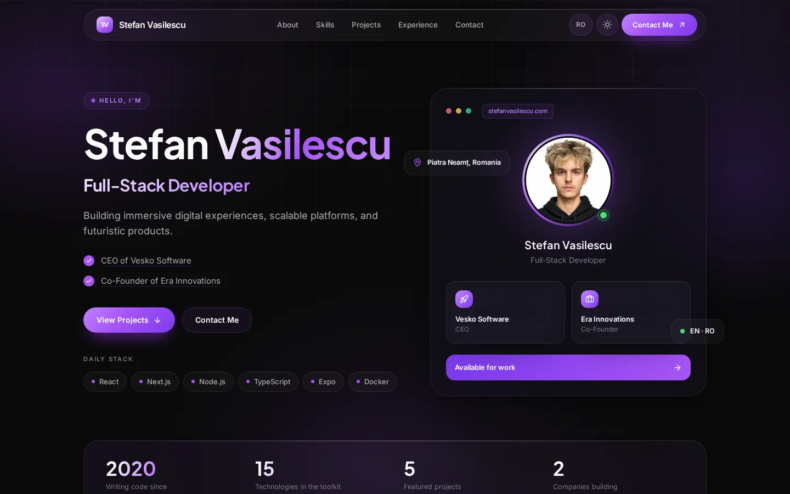

<table>
  <tr>
    <td width="50%">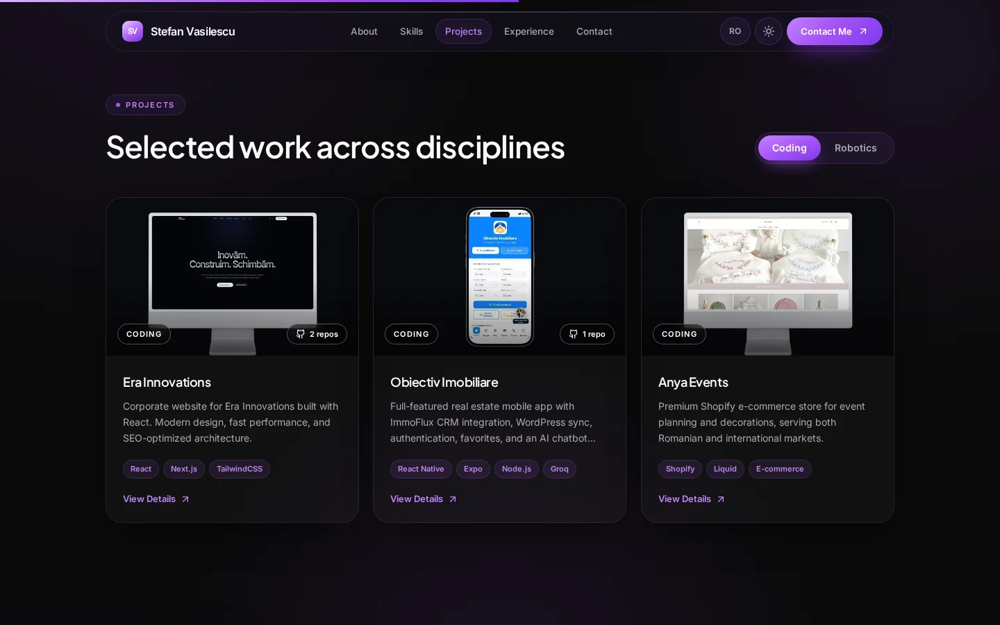</td>
    <td width="50%">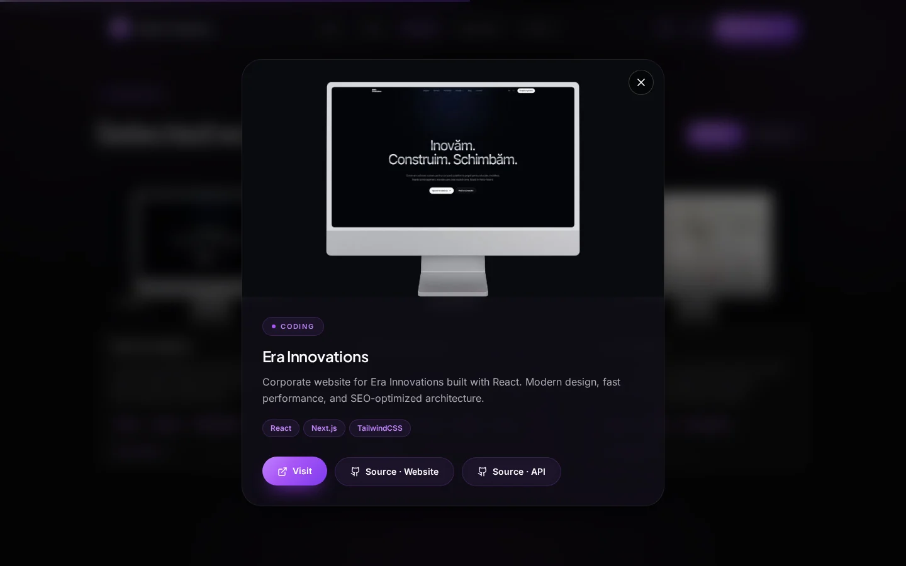</td>
  </tr>
  <tr>
    <td width="50%">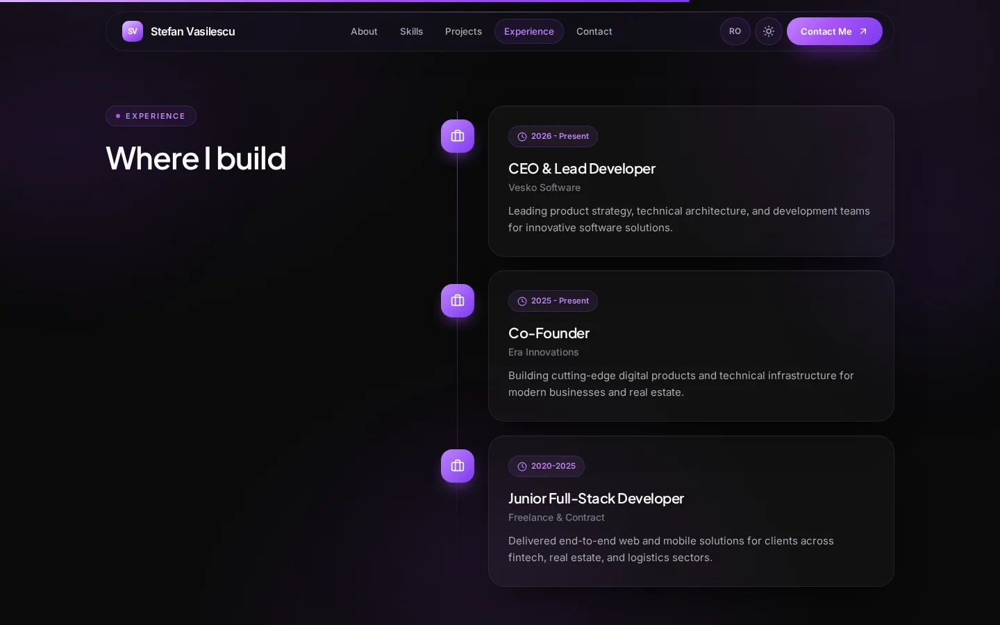</td>
    <td width="50%">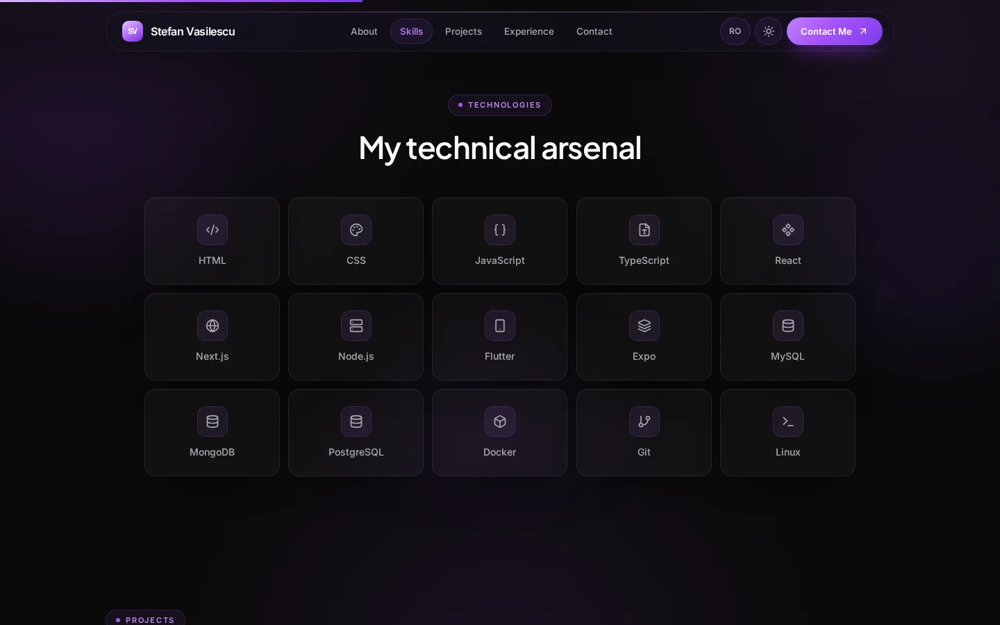</td>
  </tr>
</table>

### Light theme

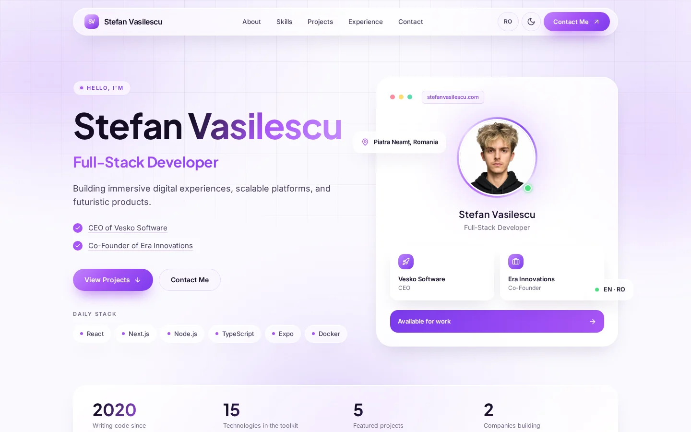

<table>
  <tr>
    <td width="50%">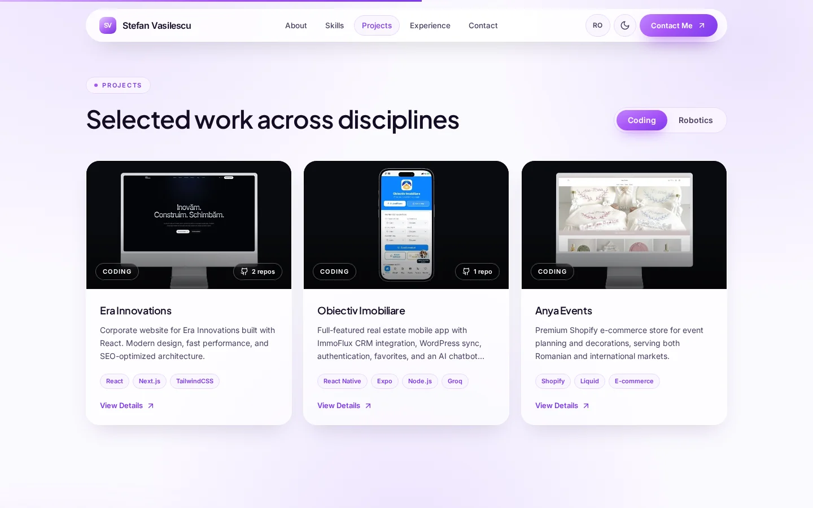</td>
    <td width="50%">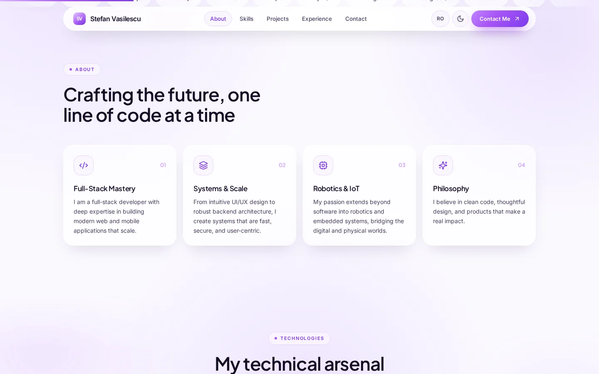</td>
  </tr>
  <tr>
    <td width="50%">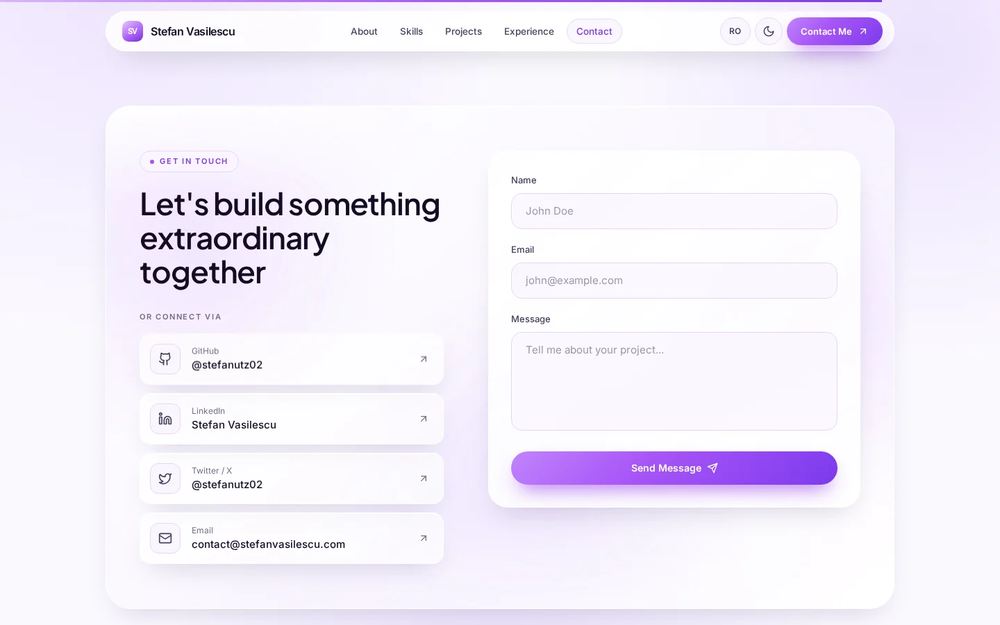</td>
    <td width="50%">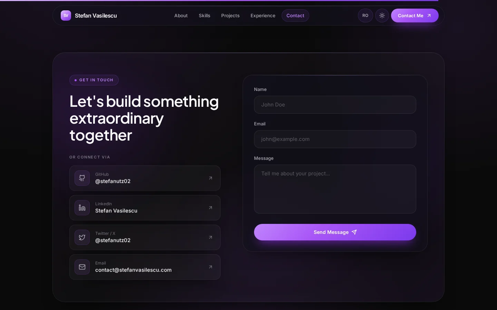</td>
  </tr>
</table>

### Mobile

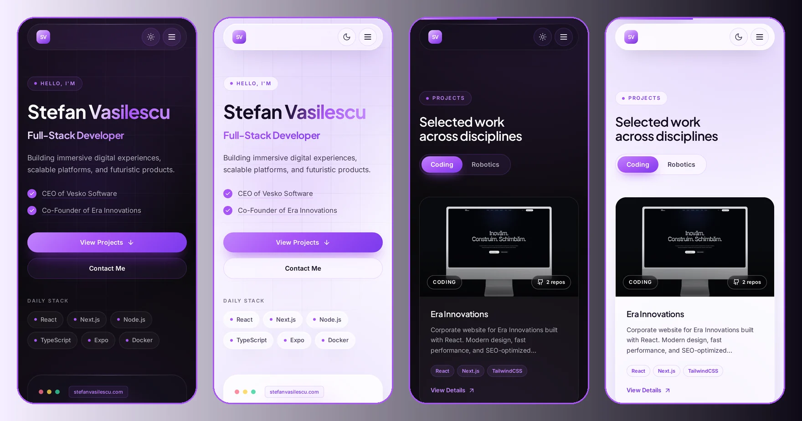

## Features

- **Dark-first theming with a light mode.** The site is dark by default, and a sun/moon toggle switches to light. The choice is saved, and an inline script applies it before the first paint, so the page never flashes the wrong theme. The browser `theme-color` updates along with it.
- **Glass design system.** `.glass`, `.glass-strong`, `.glass-tint` and `.glass-edge` surfaces, drifting aurora blobs, a masked grid background and a top-of-page scroll progress bar.
- **Bilingual UI (EN / RO).** Every string is translated, including the project descriptions. The chosen language is saved and applied to `<html lang>`.
- **Single-page layout.** Hero, About, Technologies, Projects, Experience, Contact and Footer. The header highlights the section in view with a sliding pill.
- **Hero profile card.** A glass card with your portrait inside a rotating conic ring, an "available" status dot, role tiles, floating chips and pointer-reactive 3D tilt.
- **Project gallery.** *Coding* and *Robotics* tabs with animated filtering. Each card shows its GitHub repo count. The detail modal has Visit, Source (one button per repo), App Store and Play Store links, closes with Esc, and locks page scroll. Projects without a screenshot get a branded gradient cover.
- **Motion design.** Blur-in reveals, staggered grids, an infinite technology marquee, spring tab transitions and a sticky timeline heading, all built with Framer Motion.
- **Production SEO.** Open Graph and Twitter cards, JSON-LD (Person, WebSite, WebPage, two organizations, portrait `ImageObject`), canonical URL, geo meta, image sitemap with hreflang, robots.txt and a PWA manifest.
- **Accessible by default.** Semantic landmarks, labelled form fields, keyboard-operable cards and dialog, visible focus rings, `prefers-reduced-motion` support, and a `<noscript>` fallback that shows all content without JavaScript.
- **Static export.** `next build` outputs a fully static `dist/` folder with no server required.

## Tech stack

| Layer            | Choice                                                                        |
| ---------------- | ----------------------------------------------------------------------------- |
| Framework        | **Next.js 14** (App Router, `output: 'export'`)                               |
| Language         | **TypeScript 5** (strict mode)                                                |
| Styling          | **Tailwind CSS 3.4** + CSS-variable theme tokens (`darkMode: 'class'`)        |
| Animation        | **Framer Motion 11**                                                          |
| Icons            | **lucide-react**                                                              |
| Fonts            | **Inter** (body), **Plus Jakarta Sans** (display), **Caveat** (signature)     |
| Hosting          | Any static host (Vercel, Netlify, Cloudflare Pages, GitHub Pages, S3)         |

## Why these choices

**Next.js with static export.** A portfolio doesn't need server-side rendering, an API layer or revalidation. It needs to load instantly, deploy anywhere and cost nothing to host. `output: 'export'` keeps Next's developer experience (font loading, metadata API) and produces a plain folder of HTML and assets.

**CSS variables for theming.** Every theme-dependent color (surface, ink, glass, chip, aurora, grid) is a CSS variable, with light values on `:root` and dark values on `.dark`. Tailwind reads them through `rgb(var(--ink) / <alpha-value>)`, so `text-ink`, `border-line` and `.glass` work in both themes without adding `dark:` variants to every component.

**A shared design language with Vesko.** Using the same glass system, spacing and motion vocabulary as [vesko.ro](https://vesko.ro) makes my personal brand and my company feel related. The purple palette keeps them easy to tell apart.

**Framer Motion over CSS animations.** Shared `layoutId` pills in the nav and project tabs, `AnimatePresence` for filtering and the modal, and viewport-triggered staggers are hard to coordinate in pure CSS. Framer Motion lets me write them declaratively.

**Fewer dependencies.** v2 drops Lenis, the custom cursor, `clsx` and `tailwind-merge`. Native smooth scrolling and plain class strings are enough, which gives a smaller bundle and less to maintain.

**A custom `LanguageProvider` instead of an i18n library.** Two languages and one typed translation object don't need `next-intl` or `i18next`. A small context provider is enough.

**No backend in the repo.** The contact form posts to a separate API at `email-api.stefanvasilescu.com`, so the front end stays deployable as static files.

## Project structure

```
.
├── app/
│   ├── globals.css           # Theme tokens (light / .dark), glass system, buttons, chips
│   ├── layout.tsx            # Fonts, SEO metadata, JSON-LD, theme script, providers
│   └── page.tsx              # Single-page composition of all sections
├── components/
│   ├── About.tsx             # Four numbered glass cards
│   ├── Contact.tsx           # Social links + form, POSTs to the email API
│   ├── Experience.tsx        # Vertical timeline with sticky heading
│   ├── Footer.tsx            # Signature, section / company / social columns
│   ├── Hero.tsx              # Copy, glass profile card, stats strip, marquee
│   ├── LanguageProvider.tsx  # EN/RO context, persisted, syncs <html lang>
│   ├── Logo.tsx              # "SV" monogram
│   ├── Motion.tsx            # Reveal, Stagger, Tilt, Marquee, ScrollProgress
│   ├── Navbar.tsx            # Glass pill header, active-section pill, lang + theme toggles
│   ├── Projects.tsx          # Tabbed gallery + detail modal
│   ├── Skills.tsx            # 15-tile technology grid
│   ├── ThemeProvider.tsx     # Dark/light context + no-flash inline script
│   └── UI.tsx                # Aurora, Eyebrow, SectionHead
├── lib/
│   ├── data.ts               # Projects, GitHub repos, skills, socials, companies, API URL
│   └── translations.ts       # All copy for EN and RO, fully typed
├── public/
│   ├── projects/             # Project preview images
│   ├── stefan-vasilescu-portrait.jpg
│   ├── og-image.jpg          # Open Graph card
│   ├── icon-*.png, icon.svg  # PWA + favicons
│   ├── manifest.json
│   ├── robots.txt
│   └── sitemap.xml
├── docs/screenshots/         # README images
├── LICENSE                   # MIT: source code only
├── LICENSE-CONTENT           # CC BY-NC-SA 4.0: written + visual content
├── next.config.js            # output: 'export', trailingSlash, distDir: 'dist'
├── tailwind.config.ts        # Brand scale + semantic tokens, keyframes
└── package.json
```

## How it works

**Theme.** `ThemeProvider` exposes `{ theme, toggleTheme }`. The server renders `<html class="dark">`, and an inline script in `<head>` removes the class before first paint only if `localStorage.theme === 'light'`. Toggling flips the class, saves the choice and updates `<meta name="theme-color">`. Every color reads from CSS variables, so no component needs theme-specific code.

**Languages.** `LanguageProvider` exposes `{ lang, t, toggleLanguage, setLanguage }`. Components read `t.<section>.<key>`, and project descriptions come from `description[lang]` in `lib/data.ts`. The translation object uses a `const` assertion, so every key is type-checked.

**Navigation.** In-page anchors (`#about`, `#projects`, …) use native smooth scrolling, and `scroll-padding-top` keeps headings clear of the fixed header. An `IntersectionObserver` tracks which section is in view and moves the active pill.

**Motion primitives.** `Motion.tsx` holds everything animated: `Reveal` fades, lifts and un-blurs on enter; `Stagger`/`StaggerItem` sequence grids; `Tilt` adds pointer-reactive perspective; `Marquee` loops the tech ribbon; `ScrollProgress` draws the top bar. All of them respect `prefers-reduced-motion`.

**Projects.** `lib/data.ts` holds a typed `projects` array. Each project has bilingual descriptions, tags, an optional image, `link`, `appStore`, `playStore`, and a `github` array of `{ label, url }`. Cards show the repo count, and the modal renders one Source button per repo.

**Contact form.** It POSTs `{ name, email, message }` to `CONTACT_API_URL` and shows one of four states: `idle`, `sending`, `success` or `error`.

**SEO.** `app/layout.tsx` exports full Open Graph and Twitter metadata plus a JSON-LD graph that links me, the site, the homepage and both companies.

## Getting started

**Prerequisites:** Node.js 18.17+ and npm, pnpm or yarn.

```bash
git clone https://github.com/stefanutz02/stefan-vasilescu-portfolio.git
cd stefan-vasilescu-portfolio
npm install
npm run dev        # http://localhost:3000
```

Lint with `npm run lint`.

## Build & deploy

```bash
npm run build
```

This produces a fully static `dist/` directory.

- **Vercel**: zero-config.
- **Cloudflare Pages / Netlify**: build command `npm run build`, output directory `dist`.
- **GitHub Pages**: publish the `dist` folder to a `gh-pages` branch.

> ⚠️ Because of `output: 'export'`, features that need a Node runtime (Image Optimization API, Route Handlers, `revalidate`, middleware) are unavailable. `images.unoptimized: true` in `next.config.js` accounts for this.

## Customization guide

> Before reusing this code, read the [License](#license): the **content** of the site is **not** MIT.

| What you want to change        | Where to look                                                 |
| ------------------------------ | ------------------------------------------------------------- |
| Name, title, section copy      | `lib/translations.ts`                                         |
| Hero stats                     | `hero.stats` in `lib/translations.ts`                         |
| Projects, repos, store links   | `projects` in `lib/data.ts`                                   |
| Technology tiles / marquee     | `skills` in `lib/data.ts` (+ icon map in `Skills.tsx`)        |
| Social links, companies        | `socials`, `companies` in `lib/data.ts`                       |
| Contact API endpoint           | `CONTACT_API_URL` in `lib/data.ts`                            |
| Theme colors (both modes)      | CSS variables in `app/globals.css`                            |
| Brand scale, fonts, keyframes  | `tailwind.config.ts`, fonts in `app/layout.tsx`               |
| Default theme                  | `themeScript` in `components/ThemeProvider.tsx`               |
| SEO, OG image, JSON-LD         | `app/layout.tsx`                                              |
| Sitemap & robots               | `public/sitemap.xml`, `public/robots.txt`                     |

To add a project without a screenshot, leave out `image` and the card uses the gradient cover. To add a third language, extend `translations` and the `description` records in `data.ts`, then update the `Language` type.

## Performance & SEO

- **Static export.** One HTML file, served straight from a CDN.
- **Small client bundle.** About 150 kB first load, with no smooth-scroll or cursor libraries.
- **`font-display: swap`**, with `latin-ext` subsets so Romanian diacritics (ă, â, î, ș, ț) render in the brand fonts.
- **No-flash theming.** The theme is set before paint, so there is no layout or color shift.
- **Reduced motion.** Animations and transitions collapse when `prefers-reduced-motion: reduce` is set.
- **Structured data.** JSON-LD links the person, site, page, portrait and companies.
- **Image SEO.** Descriptive filenames and alt text, plus an image sitemap for the portrait, OG image and project images.

## Changelog

See [Releases](https://github.com/stefanutz02/stefan-vasilescu-portfolio/releases) for full notes.

- **v2.0.0**: complete redesign in the Vesko glass design language, dark-first theme with light mode, bilingual project descriptions, GitHub repo links on projects, leaner dependencies.
- **v1.1.0**: hero portrait with animated ring, image SEO foundation, mobile layout fixes, sitemap namespaces.

## Roadmap

- [x] ~~Light theme toggle~~ (shipped in v2.0.0)
- [ ] Blog section (MDX) for writeups on projects and stack decisions
- [ ] Per-project case-study pages with deeper screenshots and architecture notes
- [ ] Real photos for ERA Weather and Vesko Rover to replace the gradient covers
- [ ] Translate the `alt` text of project images alongside the section copy

## Contact

- **Website**: [stefanvasilescu.com](https://stefanvasilescu.com)
- **Email**: [contact@stefanvasilescu.com](mailto:contact@stefanvasilescu.com)
- **LinkedIn**: [linkedin.com/in/stefanvasilescu](https://linkedin.com/in/stefanvasilescu)
- **GitHub**: [@stefanutz02](https://github.com/stefanutz02)
- **Vesko Software**: [vesko.ro](https://vesko.ro)
- **Era Innovations**: [erainnovations.ro](https://erainnovations.ro)

## License

This repository uses **dual licensing**: one license for the code, another for the content that makes this *my* portfolio.

### 📦 Source code: MIT License

All `.ts`, `.tsx`, `.js`, `.css`, `.json` and configuration files are licensed under the [**MIT License**](LICENSE). You may study, fork, modify and reuse the code, including commercially, as long as you keep the copyright notice. That covers the component architecture, the theme system, the glass design system, the `LanguageProvider` pattern, the motion primitives and the Tailwind setup.

### 🎨 Content: Creative Commons BY-NC-SA 4.0

The *written and visual content* that identifies this site as Stefan Vasilescu's portfolio is licensed under [**CC BY-NC-SA 4.0**](https://creativecommons.org/licenses/by-nc-sa/4.0/).

[](https://creativecommons.org/licenses/by-nc-sa/4.0/)

This covers:

- The **written copy** in `lib/translations.ts` and the project descriptions in `lib/data.ts`
- Every **image and photograph** in `public/` (including `stefan-vasilescu-portrait.jpg`, `og-image.jpg` and `public/projects/`) and the screenshots in `docs/screenshots/`
- All **icons**, **favicons**, the **SV monogram** and the **PWA artwork**
- The **"Stefan Vasilescu" name, signature and visual identity** as they appear on the site

You may share and adapt these materials only with **attribution** (credit Stefan Vasilescu with a link to [stefanvasilescu.com](https://stefanvasilescu.com)), for **non-commercial** purposes, and under the **same license**.

### TL;DR

> ✅ **Fork the repo, learn from the code, and rebuild it as your own portfolio with your own content.**
>
> ❌ **Do not deploy a copy that still contains my name, my photo, my project descriptions, my signature or my identity, even with attribution.**

If you're unsure whether your use is allowed, [open an issue](https://github.com/stefanutz02/stefan-vasilescu-portfolio/issues) or [email me](mailto:contact@stefanvasilescu.com).

---

<div align="center">

**Built with care in Romania.**

If this repo helped you ship your own portfolio, a ⭐ would mean a lot.

</div>
